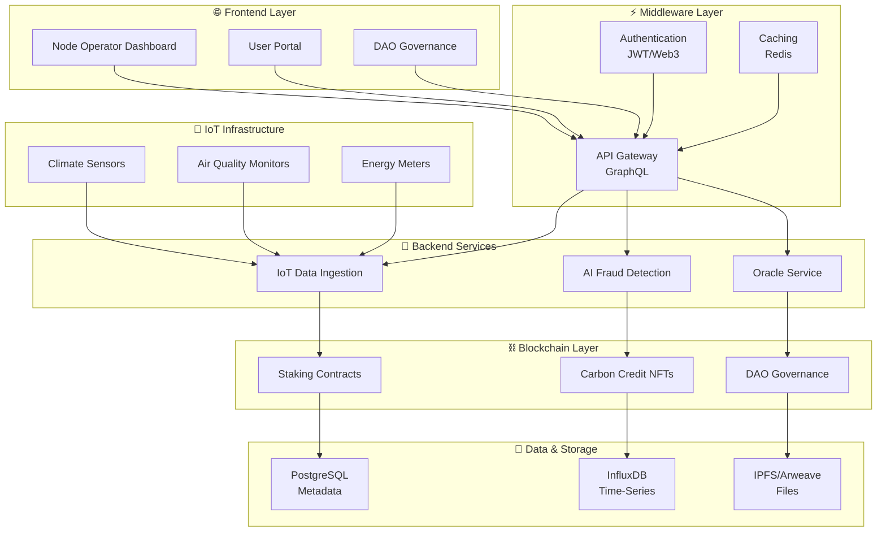
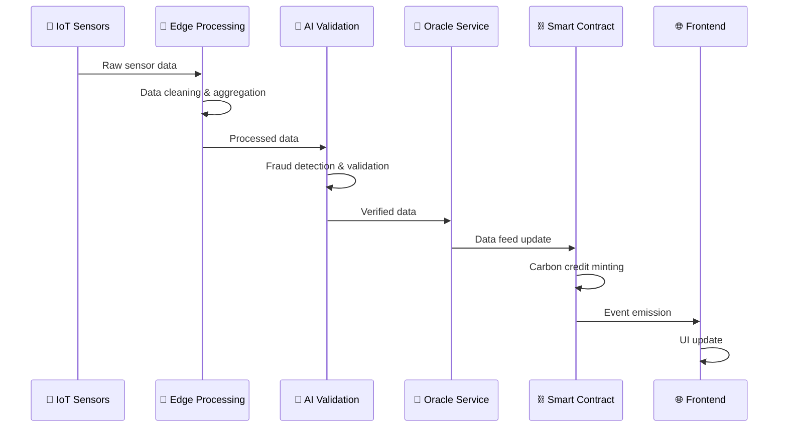
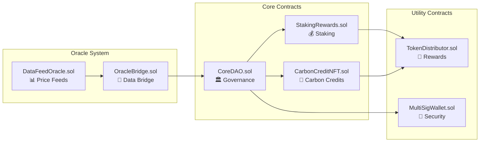
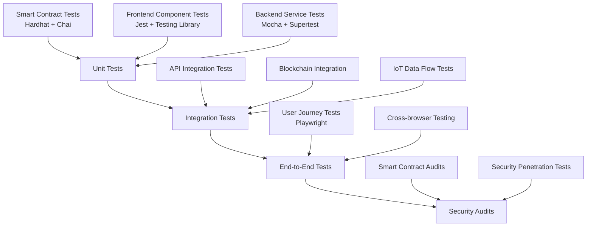
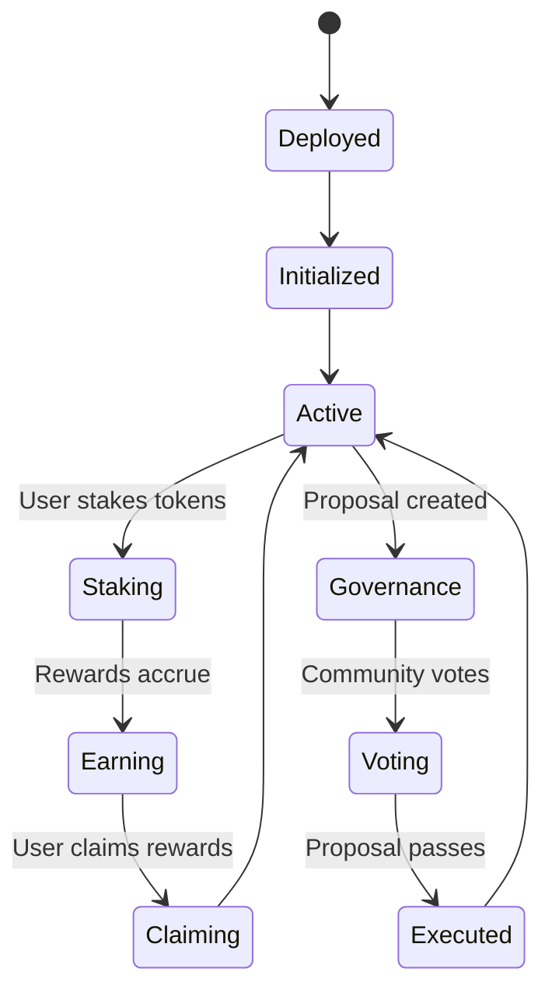
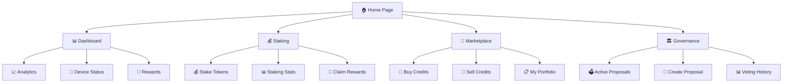
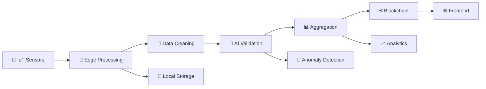
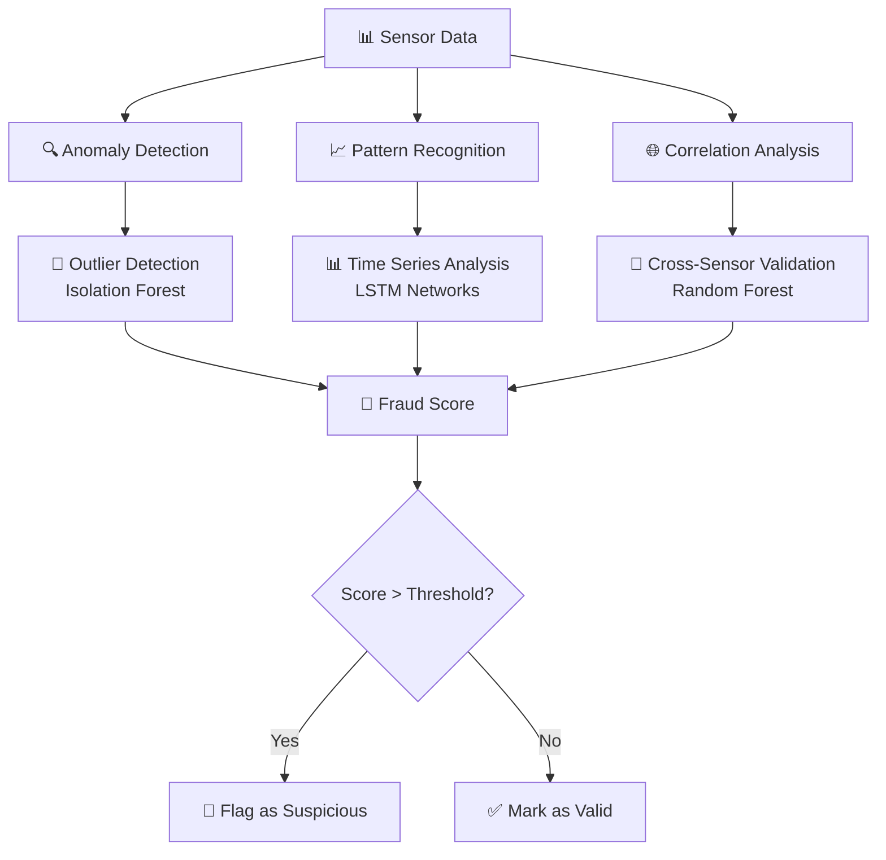
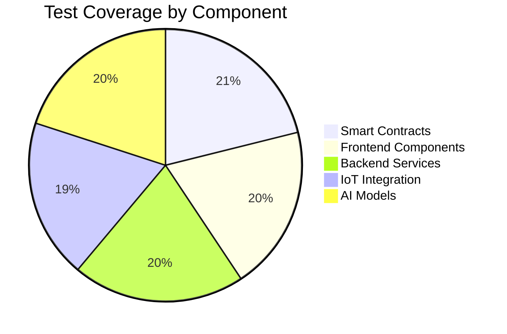
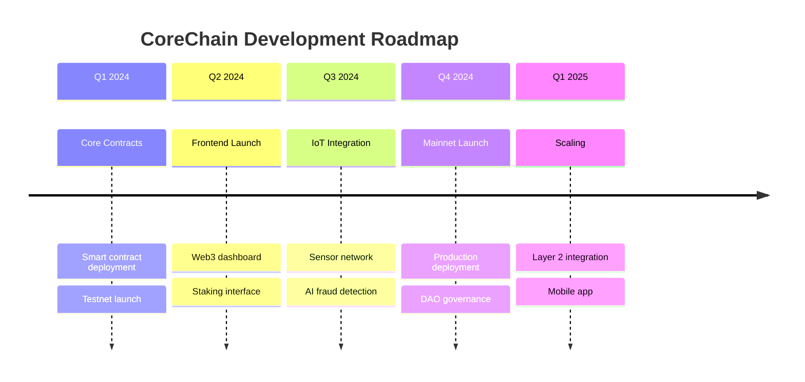

# 🌍 CoreChain Climate Network

<div align="center">


**A Decentralized Physical Infrastructure (DePIN) for Carbon Credit Marketplace**

[](https://opensource.org/licenses/MIT)
[](https://hardhat.org/)
[](https://nextjs.org/)
[](https://www.typescriptlang.org/)

[🚀 Quick Start](#-quick-start) • [📖 Documentation](#-documentation) • [🏗️ Architecture](#-architecture) • [🤝 Contributing](#-contributing)

</div>

---

## 📋 Table of Contents

- [🌟 Overview](#-overview)
- [✨ Features](#-features)
- [🏗️ Architecture](#-architecture)
- [🚀 Quick Start](#-quick-start)
- [📦 Project Structure](#-project-structure)
- [🔧 Development](#-development)
- [📊 Smart Contracts](#-smart-contracts)
- [🌐 Frontend Applications](#-frontend-applications)
- [📡 IoT Integration](#-iot-integration)
- [🤖 AI Fraud Detection](#-ai-fraud-detection)
- [📚 API Documentation](#-api-documentation)
- [🧪 Testing](#-testing)
- [🚢 Deployment](#-deployment)
- [🤝 Contributing](#-contributing)
- [📄 License](#-license)

---

## 🌟 Overview

CoreChain Climate Network is a revolutionary **Decentralized Physical Infrastructure (DePIN)** project that combines blockchain technology, IoT sensors, and AI-powered fraud detection to create a transparent and verifiable carbon credit marketplace. Our platform enables real-world environmental data collection, verification, and tokenization of carbon credits as RWAs (Real World Assets).

### 🎯 Mission
To democratize carbon credit markets through decentralized infrastructure, ensuring transparency, verifiability, and fair access to climate action rewards.

---

## ✨ Features

### 🔗 **Blockchain Infrastructure**
- **Smart Contract Suite**: Staking, Carbon Credits (NFTs), DAO Governance
- **Multi-chain Support**: Ethereum, Polygon, Arbitrum compatibility
- **Chainlink Integration**: Real-world data oracles and price feeds

### 🌐 **Web3 Frontend**
- **Node Operator Dashboard**: IoT device management and monitoring
- **User Portal**: Staking, trading, and carbon credit marketplace
- **DAO Governance Interface**: Community voting and proposal management

### 📡 **IoT & Data Infrastructure**
- **Real-time Sensor Network**: Climate, air quality, energy monitoring
- **Edge Computing**: Local data processing and validation
- **Secure Data Transmission**: Encrypted communication protocols

### 🤖 **AI-Powered Verification**
- **Fraud Detection**: ML algorithms for anomaly detection
- **Data Validation**: Automated verification of sensor readings
- **Predictive Analytics**: Environmental trend analysis

---

## 🏗️ Architecture

### 🔄 System Flow Diagram



### 🔄 Data Flow Architecture



### 🏛️ Smart Contract Architecture



---

## 🚀 Quick Start

### 📋 Prerequisites

- **Node.js** v18+ and npm/yarn
- **Git** for version control
- **MetaMask** or compatible Web3 wallet
- **Docker** (optional, for containerized deployment)

### ⚡ Installation

1. **Clone the repository**
   ```bash
   git clone https://github.com/your-org/CoreChain.git
   cd CoreChain
   ```

2. **Install dependencies**
   ```bash
   # Root dependencies (Hardhat, contracts)
   npm install
   
   # Frontend dependencies
   cd frontend
   npm install
   cd ..
   
   # Backend services
   cd backend
   npm install
   cd ..
   ```

3. **Environment setup**
   ```bash
   cp .env.example .env
   # Edit .env with your configuration
   ```

4. **Compile smart contracts**
   ```bash
   npx hardhat compile
   ```

5. **Run tests**
   ```bash
   npx hardhat test
   ```

6. **Start development servers**
   ```bash
   # Terminal 1: Hardhat local network
   npx hardhat node
   
   # Terminal 2: Frontend development server
   cd frontend
   npm run dev
   
   # Terminal 3: Backend services
   cd backend
   npm run dev
   ```

### 🌐 Access Applications

- **Frontend Dashboard**: http://localhost:3000
- **API Gateway**: http://localhost:4000/graphql
- **Hardhat Network**: http://localhost:8545

---

## 📦 Project Structure

```
CoreChain/
├── 📁 contracts/              # Smart contracts
│   ├── CoreDAO.sol           # DAO governance contract
│   ├── StakingRewards.sol    # Staking mechanism
│   ├── CarbonCreditNFT.sol   # Carbon credit tokenization
│   └── oracles/              # Oracle contracts
├── 📁 frontend/              # Next.js Web3 frontend
│   ├── src/pages/           # Application pages
│   ├── src/components/      # Reusable components
│   └── src/hooks/           # Custom React hooks
├── 📁 backend/              # Backend services
│   ├── api-gateway/         # GraphQL API gateway
│   ├── ai-fraud-detection/  # ML fraud detection
│   └── iot-data-ingestion/  # IoT data processing
├── 📁 iot/                  # IoT device firmware
├── 📁 scripts/              # Deployment scripts
├── 📁 test/                 # Smart contract tests
├── 📁 docs/                 # Documentation
└── 📄 hardhat.config.js     # Hardhat configuration
```

---

## 🔧 Development

### 🛠️ Available Scripts

```bash
# Smart Contract Development
npm run compile          # Compile contracts
npm run test            # Run contract tests
npm run deploy:local    # Deploy to local network
npm run deploy:testnet  # Deploy to testnet
npm run verify          # Verify contracts on Etherscan

# Frontend Development
cd frontend
npm run dev            # Start development server
npm run build          # Build for production
npm run start          # Start production server
npm run lint           # Run ESLint

# Backend Services
cd backend
npm run dev            # Start all services in development
npm run build          # Build services
npm run start          # Start production services
```

### 🧪 Testing Strategy



---

## 📊 Smart Contracts

### 🏛️ Core Contracts

| Contract | Description | Features |
|----------|-------------|----------|
| **CoreDAO.sol** | DAO governance system | Voting, proposals, timelock |
| **StakingRewards.sol** | Token staking with rewards | APY calculation, compound rewards |
| **CarbonCreditNFT.sol** | Carbon credit tokenization | ERC-721, metadata, verification |
| **OracleBridge.sol** | Chainlink oracle integration | Price feeds, data validation |

### 📈 Contract Interaction Flow



---

## 🌐 Frontend Applications

### 🎨 Design System

Our frontend uses a modern, responsive design system built with:

- **Next.js 14** with App Router
- **TypeScript** for type safety
- **Tailwind CSS** for styling
- **RainbowKit** for Web3 wallet connections
- **Wagmi** for Ethereum interactions
- **React Query** for data fetching

### 📱 Application Pages



---

## 📡 IoT Integration

### 🌡️ Supported Sensors

| Sensor Type | Metrics | Update Frequency |
|-------------|---------|------------------|
| **Climate Sensors** | Temperature, Humidity, Pressure | 1 minute |
| **Air Quality** | PM2.5, PM10, CO2, NOx | 30 seconds |
| **Energy Meters** | Power consumption, Solar generation | 5 seconds |
| **Soil Sensors** | Moisture, pH, Nutrients | 15 minutes |

### 📊 Data Processing Pipeline



---

## 🤖 AI Fraud Detection

### 🧠 Machine Learning Models

Our AI system uses multiple models for comprehensive fraud detection:



### 🎯 Detection Capabilities

- **Sensor Tampering**: Physical manipulation detection
- **Data Injection**: Fake data submission prevention
- **Coordinated Attacks**: Multiple device compromise detection
- **Environmental Impossibilities**: Physically impossible readings

---

## 📚 API Documentation

### 🔗 GraphQL Schema

```graphql
type Query {
  # User queries
  user(address: String!): User
  stakingInfo(address: String!): StakingInfo
  
  # Carbon credit queries
  carbonCredits(filter: CarbonCreditFilter): [CarbonCredit!]!
  carbonCredit(tokenId: ID!): CarbonCredit
  
  # IoT data queries
  sensorData(deviceId: String!, timeRange: TimeRange!): [SensorReading!]!
  deviceStatus(deviceId: String!): DeviceStatus
  
  # Governance queries
  proposals(status: ProposalStatus): [Proposal!]!
  proposal(id: ID!): Proposal
}

type Mutation {
  # Staking mutations
  stake(amount: String!): Transaction!
  unstake(amount: String!): Transaction!
  claimRewards: Transaction!
  
  # Governance mutations
  createProposal(input: ProposalInput!): Proposal!
  vote(proposalId: ID!, support: Boolean!): Vote!
  
  # Carbon credit mutations
  mintCarbonCredit(input: CarbonCreditInput!): CarbonCredit!
  transferCarbonCredit(tokenId: ID!, to: String!): Transaction!
}
```

### 🔌 REST Endpoints

```bash
# Authentication
POST /auth/login
POST /auth/refresh

# IoT Data
GET /api/devices
POST /api/devices/:id/data
GET /api/devices/:id/status

# Analytics
GET /api/analytics/overview
GET /api/analytics/environmental
GET /api/analytics/rewards
```

---

## 🧪 Testing

### 🔬 Test Coverage



### 🚀 Running Tests

```bash
# Smart contract tests
npx hardhat test
npx hardhat coverage

# Frontend tests
cd frontend
npm run test
npm run test:coverage

# Backend tests
cd backend
npm run test
npm run test:integration

# End-to-end tests
npm run test:e2e
```

---

## 🚢 Deployment

### 🌍 Supported Networks

| Network | Chain ID | Status | Contract Addresses |
|---------|----------|--------|--------------------|
| **Ethereum Mainnet** | 1 | 🟢 Live | [View on Etherscan](https://etherscan.io) |
| **Polygon** | 137 | 🟢 Live | [View on PolygonScan](https://polygonscan.com) |
| **Arbitrum One** | 42161 | 🟡 Testnet | [View on Arbiscan](https://arbiscan.io) |
| **Base** | 8453 | 🔄 Planned | Coming Soon |

### 🔧 Deployment Scripts

```bash
# Deploy to testnet
npm run deploy:testnet

# Deploy to mainnet (requires multisig)
npm run deploy:mainnet

# Verify contracts
npm run verify:etherscan

# Update frontend configuration
npm run update:contracts
```

### 🐳 Docker Deployment

```bash
# Build all services
docker-compose build

# Start the full stack
docker-compose up -d

# View logs
docker-compose logs -f
```

---

## 🤝 Contributing

We welcome contributions from the community! Here's how you can help:

### 🛠️ Development Workflow

```mermaid
gitgraph
    commit id: "main"
    branch feature/new-feature
    checkout feature/new-feature
    commit id: "Add feature"
    commit id: "Add tests"
    commit id: "Update docs"
    checkout main
    merge feature/new-feature
    commit id: "Release v1.1.0"
```

### 📝 Contribution Guidelines

1. **Fork** the repository
2. **Create** a feature branch (`git checkout -b feature/amazing-feature`)
3. **Commit** your changes (`git commit -m 'Add amazing feature'`)
4. **Push** to the branch (`git push origin feature/amazing-feature`)
5. **Open** a Pull Request

### 🔍 Code Review Process

- All PRs require at least 2 approvals
- Automated tests must pass
- Security review for smart contract changes
- Documentation updates for new features

---

## 📞 Support & Community

### 💬 Get Help

- **Discord**: [Join our community](https://discord.gg/corechain)
- **Telegram**: [Developer chat](https://t.me/corechain_dev)
- **GitHub Issues**: [Report bugs](https://github.com/your-org/CoreChain/issues)
- **Documentation**: [Full docs](https://docs.corechain.network)

### 🗺️ Roadmap



---

## 📄 License

This project is licensed under the **MIT License** - see the [LICENSE](LICENSE) file for details.

---

## 🙏 Acknowledgments

- **OpenZeppelin** for secure smart contract libraries
- **Chainlink** for reliable oracle infrastructure
- **Hardhat** for development framework
- **Next.js** team for the amazing React framework
- **The Ethereum Community** for continuous innovation

---

<div align="center">

**Built with ❤️ by the CoreChain Team**

[🌐 Website](https://corechain.network) • [📧 Email](mailto:team@corechain.network) • [🐦 Twitter](https://twitter.com/corechain)

</div>
